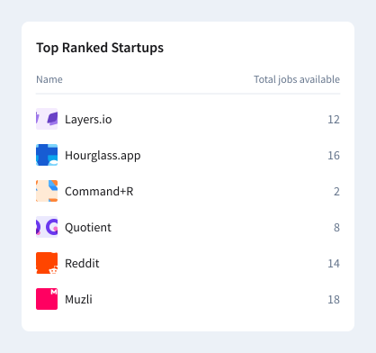

# Fullstack engineer assignment

The technical test consists of two parts. A simple Nodejs API implementation and implementing a Reactjs based frontend.

### Backend API

#### Endpoint Implementation

- [ ] Create an endpoint to retrieve the companies data provided [here](./data.json).
- [ ] Push the code to GitHub.
- [ ] _Optional Step: Host the application on a free hosting platform of your choice._

### Frontend

#### Data Fetching:

- [ ] Fetch the companies data from the API you created.
- [ ] Categorize the companies by their respective industries. For each industry, render a card displaying the list of companies belonging to that industry, sorted in alphabetical order.
- [ ] The card's title should be the industry name.
- [ ] Display the count of companies in that industry at the top right corner of the card.

